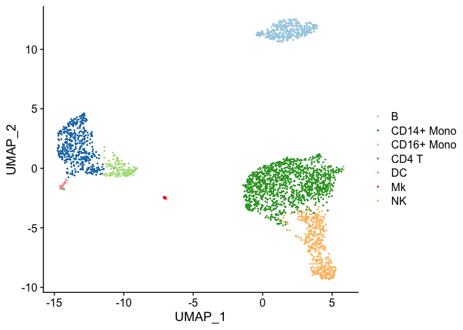

# clustifyr 

[](https://travis-ci.org/rnabioco/clustifyr)
[](https://ci.appveyor.com/project/rnabioco/clustifyr)
[](https://codecov.io/github/rnabioco/clustifyr?branch=master)

clustifyr classifies cells and clusters in single-cell RNA sequencing
experiments using reference bulk RNA-seq data sets, sorted microarray
expression data, single-cell gene signatures, or marker genes.

Single cell transcriptomes are difficult to annotate without extensive
knowledge of the underlying biology of the system in question. Even with
this knowledge, accurate identification can be challenging due to the
lack of detectable expression of common marker genes. clustifyr solves
this problem by automatically annotating single cells or clusters using
scRNA-seq, bulk RNA-seq data, microarray or marker gene lists.
Additional functions allow for exploratory analysis of similarities
between single cell RNA-seq datasets and reference data.

## Installation

``` r
# install.packages("devtools")
devtools::install_github("rnabioco/clustifyr")
```

## Example usage

In this example we use the following built-in input data:

  - an expression matrix of single cell RNA-seq data
    (`pbmc_matrix_small`)
  - a metadata data.frame (`pbmc_meta`)
  - a vector of variable genes (`pbmc_vargenes`)-
  - a matrix of bulk RNA-seq read counts (`pbmc_bulk_matrix`):

We then calculate correlation coefficients and plot them on a
pre-calculated tSNE projection (stored in `pbmc_meta`).

``` r
library(clustifyr)
library(Seurat)
res <- clustify(
  input = pbmc_matrix_small,
  metadata = pbmc_meta$classified,
  ref_mat = pbmc_bulk_matrix,
  query_genes = pbmc_vargenes
)

plot_cor(
  cor_mat = res,
  metadata = pbmc_meta,
  data_to_plot = colnames(res)[1],
  cluster_col = "classified"
)
#> [[1]]
```

<!-- -->

``` r

plot_best_call(
  cor_mat = res, 
  metadata = pbmc_meta, 
  cluster_col = "classified"
)
```

<!-- -->

Alternatively, `clustify` can take a clustered `seurat` object (both v2
and v3) and assign identities. Required data can be looked up by default
or specified. New reference matrix can be made directly from `seurat`
object as well. Other scRNAseq experiment object types are supported as
well.

  - a seuratV2 object (`s_small`)
  - or a SeuratV3 object (`s_small3`)
  - a matrix of bulk RNA-seq read counts (`pbmc_bulk_matrix`):

<!-- end list -->

``` r
res <- clustify(
  input = s_small,
  cluster_col = "res.1",
  ref_mat = pbmc_bulk_matrix,
  seurat_out = T,
  dr = "tsne"
)

res2 <- clustify(
  input = s_small3,
  cluster_col = "RNA_snn_res.1",
  ref_mat = pbmc_bulk_matrix,
  seurat_out = T,
  dr = "tsne"
)

res2
#> An object of class Seurat 
#> 230 features across 80 samples within 1 assay 
#> Active assay: RNA (230 features)
#>  2 dimensional reductions calculated: pca, tsne

new_ref_matrix <- seurat_ref(
  seurat_object = s_small,
  cluster_col = "res.1",
  var.genes_only = FALSE
)

head(new_ref_matrix)
#>                 0        1        2        3
#> MS4A1    4.517255 3.204766 0.000000 0.000000
#> CD79B    4.504191 3.549095 2.580662 0.000000
#> CD79A    4.457349 4.199849 0.000000 0.000000
#> HLA-DRA  6.211779 6.430463 3.659590 4.169965
#> TCL1A    4.394310 2.837922 0.000000 0.000000
#> HLA-DQB1 4.380289 4.325293 0.000000 1.666167
```

Similarly, `clustify_lists` can also handle identity assignment of
matrix or `seurat` object based on marker gene lists.

``` r
res <- clustify_lists(
  input = pbmc_matrix_small,
  per_cell = FALSE,
  metadata = pbmc_meta,
  cluster_col = "classified",
  marker = pbmc_markers,
  marker_inmatrix = FALSE,
  metric = "hyper"
)

res <- clustify_lists(
  input = s_small,
  per_cell = FALSE,
  marker = pbmc_markers,
  marker_inmatrix = FALSE,
  cluster_col = "res.1",
  seurat_out = TRUE,
  dr = "tsne"
)
```

## Additional reference data

More reference data (including tabula muris, immgen, etc) are available
at <https://github.com/rnabioco/clustifyrdata>.
